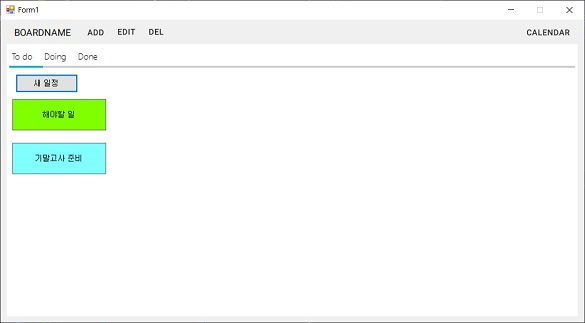
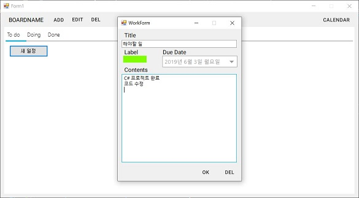
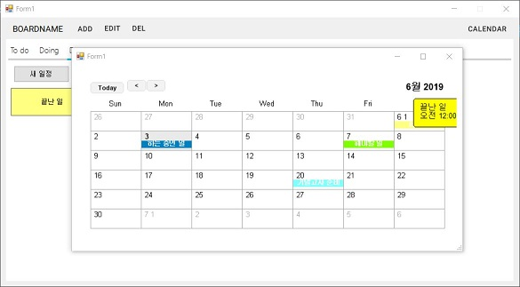

# simplePlanner

NuGet : MaterialSkin.0.2.1, MetroModernUI.1.4.0.0

Calendar : https://www.codeproject.com/Articles/378900/Calendar-NET

Calendar.NET.dll 참조 추가
****

[help](./Documentation.pdf)

## Model

## View

## Controller
